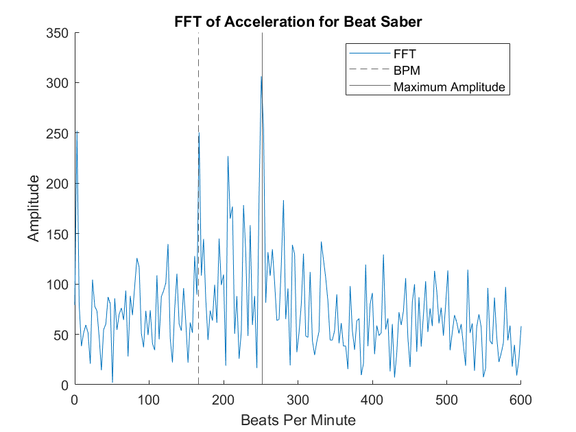

# How on-beat are you?

## Algorithm

Looking at the fft, we realised that the BPM should have the highest amplitude in the frequency domain. However, we often found that this wasn’t necessarily the case. We know that the game itself bases its motion off of the BPM and staying on beat is important to increase the player’s score, but this does [not always translate to BPM being the highest spike in frequency domain.](motion-model.md#data-collection).



To determine a user’s grade, we would want to compare their frequency spectrum to that of a perfect sine wave at the BPM. However, since each user is different, there is not one consistent magnitude that we can compare the BPM’s to. Instead, we opted to estimate this magnitude by using the highest magnitude in the whole spectrum (ignoring the first few data points, which always have consistently very high magnitudes and are thus ignored). This means that if a user’s most prominent frequency is the BPM, they get a grade of 100%, but if their BPM magnitude is only half of the tallest, their grade is 50%.

## Results

For this algorithm, the inputs are the filename where the accelerometer data is saved and the actual bpm of the song. For each song, we were given a grade which determined how close the person was to having their highest amplitude at the BPM. 

```
fft_data = get_fft(“insane6”, 100, 500);
bpm = 160;
accuracy = get_accuracy(fft_data, bpm)
```

`accuracy = 71.5`

One thing we realised was that there were often spikes at ½ BPM or at double BPM. It is possible that these could be included in determining how on-beat someone is as they are still at regular intervals. We tried to include this by averaging the magnitude at the BPM, ½ the BPM, and double the BPM, and seeing how close that is to the maximum. However, we found that this tended to produce much lower numbers, likely because both of those other values tend to be not as prominent as the BPM itself. We considered adding them instead of averaging but did not like the possibility of a result being more than 100%. A possible further exploration for this project could be attempting to figure out what signals can be filtered out and expanding the algorithm to better take into account multiples and fractions of the BPM.
