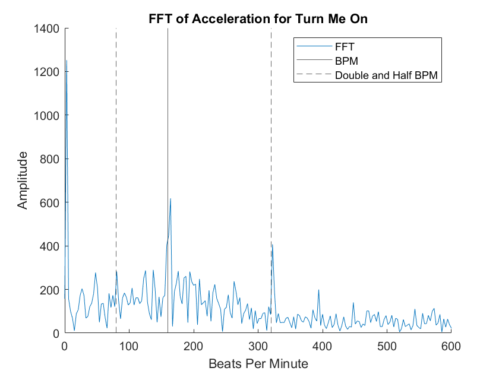
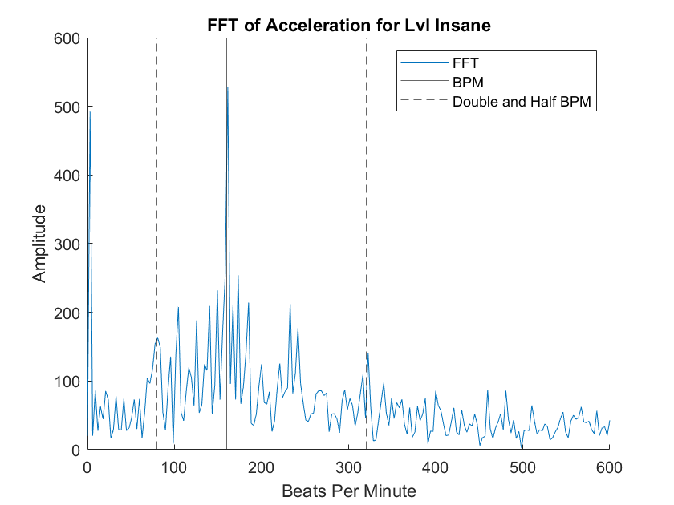
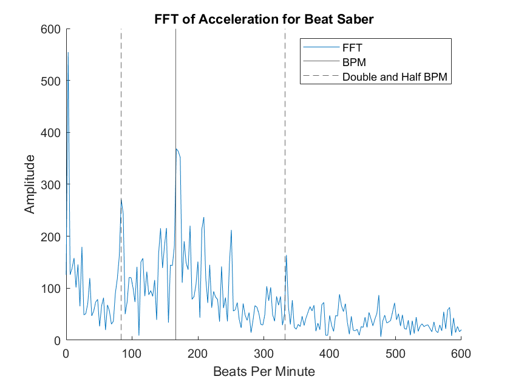

# Proof of Concept

Since we decided to focus on Normal difficulty, we only really had 2 motions: a swing down, and a swing to the side. Since the blocks are tied to the beat of the music, we would expect to see spikes in frequency at the BPM of the song, along with multiples and fractions thereof. As a proof of concept, we first plotted the FFT of our acceleration data to see if there were spikes at the BPM. There are:

Also included in this graph are the lines at both double and half the BPM. We believe this is because the blocks are coming at the player at a certain speed that correlates to the BPM. However, in particularly fast sections of the song they might come at a rate of two blocks per beat, while in particularly slow sections they might come at a rate of one block for every two beats. So while they are unlikely to be as prominent as the BPM, they are likely more prominent than the rest of the frequencies. This is true for most runs of most songs:

 

Additionally, we can see that each song has a qualitatively different shape to it, so it would be theoretically possible to create some sort of classification algorithm to identify the song.

## Next Steps

Given that BPM seems to be a major spike in the frequency domain, we believe it is possible to make some sort of “how on beat are you?” classifier using this information. Additionally, it would be interesting to look into if we can predict the BPM of the song based on this acceleration data and if we can identify the song itself.
